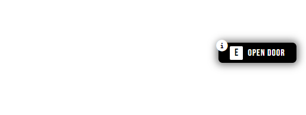

# cld_textui
A text UI for Cloud Community. Did not pay, therefore, anyone is free to share this and modify it. Do not sell.



## THE SHARING OF THIS OUTSIDE OF CLOUD COMMUNITY IS PROHIBITED
## IF DONE, THIS WILL BE MADE PUBLIC (and it was).

### Did not pay so... yeah

## Usage
```lua
-- Uses keys from the KEYS table
exports['cld_textui']:showPersist("Open door", "E", function(result, msg)
  print(result)
  print(msg)
end)

-- Custom use
CreateThread(function()
  local ped = PlayerPedId()
  local activeNotification = false
  local timeout = 1000
  while true do
   local coords = GetEntityCoords(ped)
   local dist = #(coords - vector3(-232.114, -966.42, 29.27))
   if dist < 4.0 then
     if timeout ~= 0 then
       timeout = 0
     end
     if not activeNotification then
       activeNotification = true
       exports['cld_textui']:showPersist("Open door", "E")
     end
     if IsControlJustReleased(0, 38) then
       exports['cld_textui']:hidePersist()
     end
   else
     if activeNotification then
       exports['cld_textui']:hidePersist()
       activeNotification = false
     end
     if timeout ~= 1000 then
       timeout = 1000
     end
   end
   Wait(TIMEOUT)
  end
end)
```
